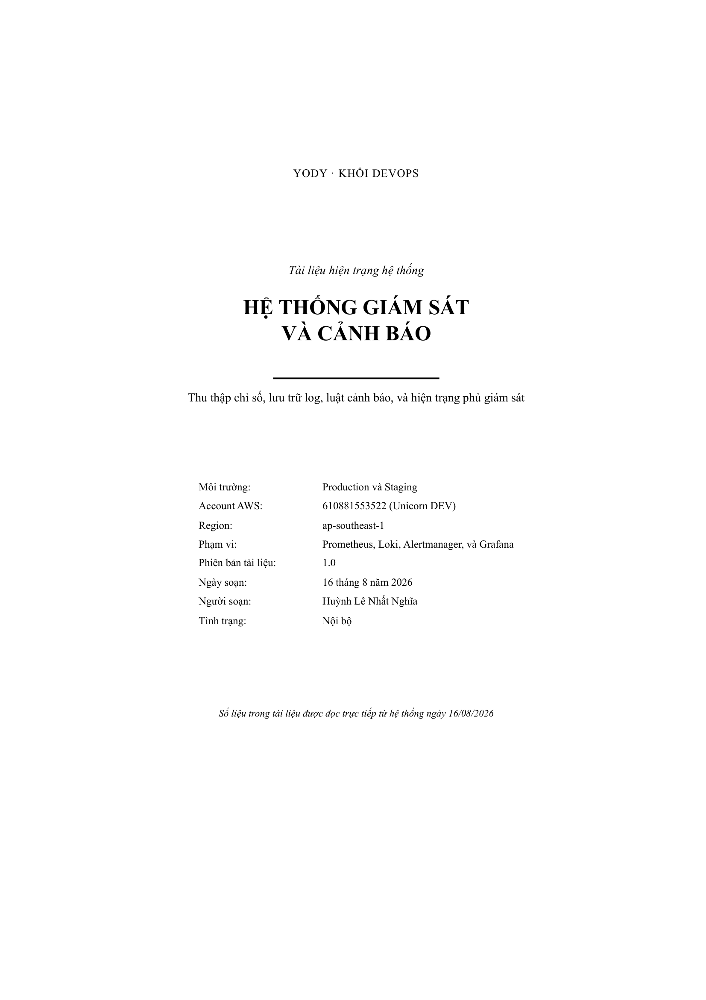
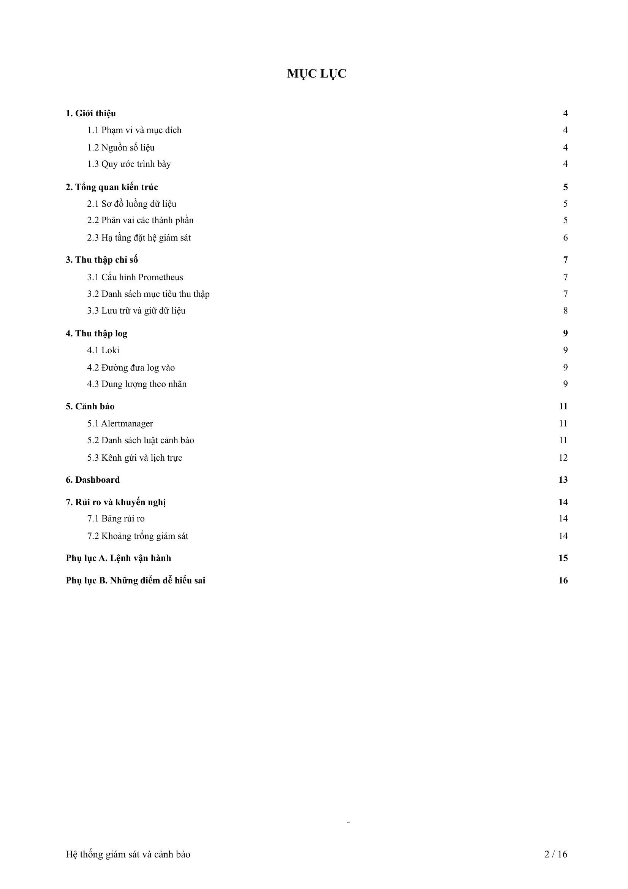
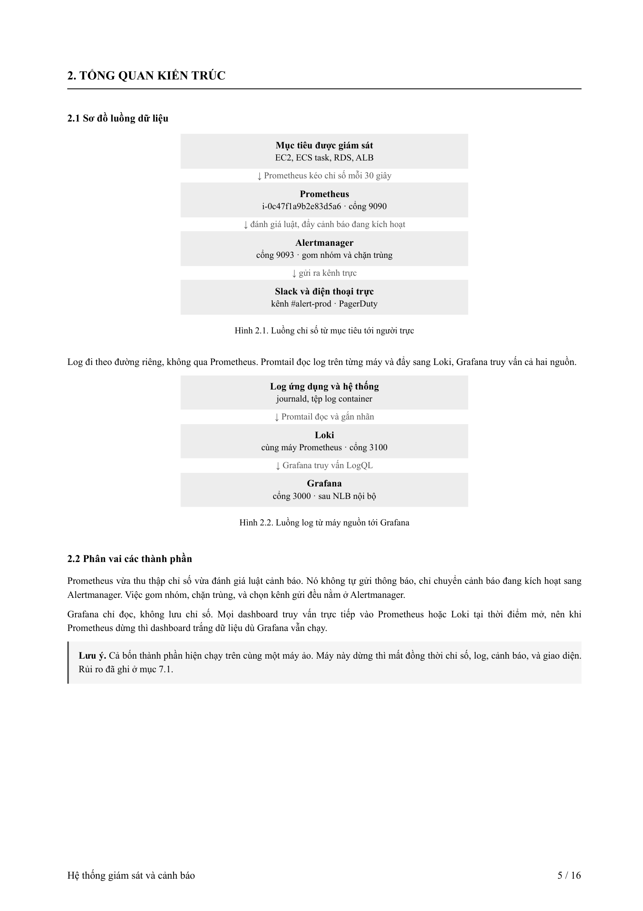
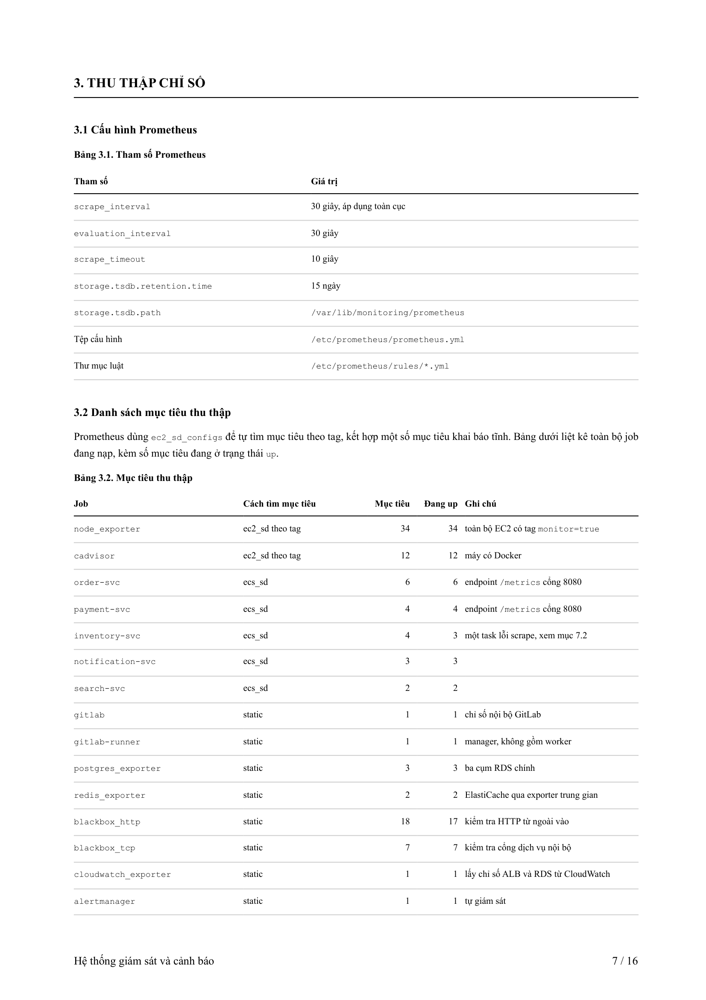
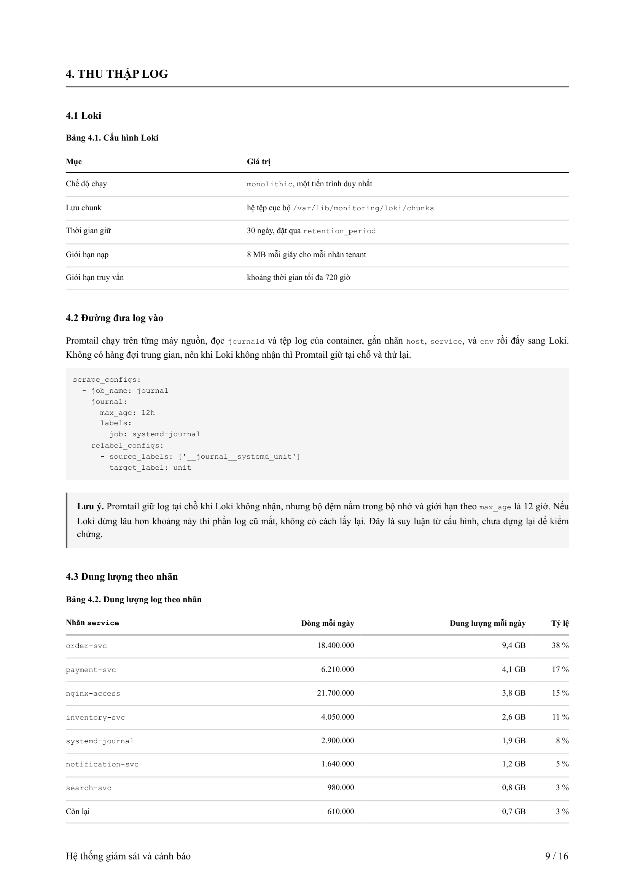
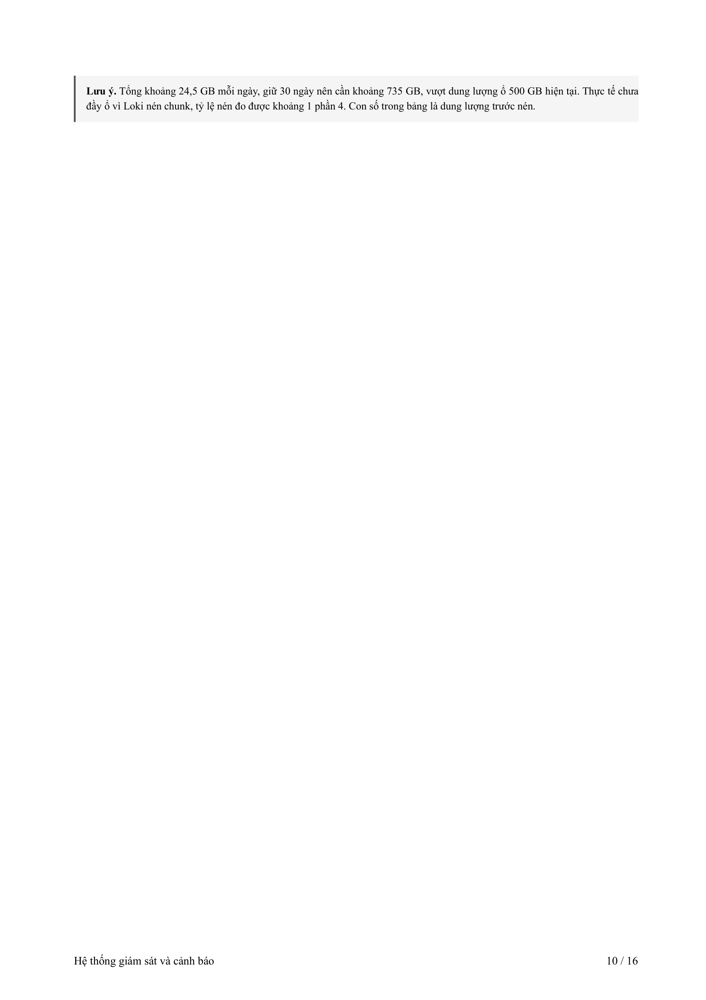

# Bộ khung tài liệu kỹ thuật — Technical Report Template

Bộ khung HTML/CSS tạo tài liệu kỹ thuật dạng PDF chuẩn doanh nghiệp, trích xuất và tái tạo từ định dạng PDF gốc. Kết xuất qua Microsoft Edge headless (CDP), tự điền số trang mục lục, chân trang lặp lại đúng quy cách.

> **Tóm tắt:** Viết nội dung bằng HTML thuần &rarr; chạy một lệnh &rarr; nhận PDF A4 hoàn chỉnh với bìa, mục lục có số trang thật, bảng số liệu, sơ đồ luồng, khối lưu ý, khối mã, và chân trang tự động.

---

## Kết quả mẫu

Dưới đây là các trang trích từ tài liệu mẫu 16 trang được sinh hoàn toàn từ bộ khung này.

### Trang bìa

<p align="center">
  
</p>

Bìa gồm: eyebrow (đơn vị), tiêu đề chính, tagline, bảng metadata, và ghi chú ngày đọc số liệu. Không có chân trang ở bìa — `merge.py` tự xử lý.

### Mục lục tự động

<p align="center">
  
</p>

Chỉ cần đặt dấu `?` ở ô số trang trong HTML, `toc.py` sẽ kết xuất PDF, đọc vị trí thật của từng tiêu đề, rồi điền số trang chính xác. Script lặp tới khi số trang ổn định.

### Sơ đồ luồng & khối lưu ý

<p align="center">
  
</p>

Sơ đồ luồng dựng bằng CSS thuần (`.flow` > `.node` + `.arrow`), không cần thư viện ngoài. Khối lưu ý (`.note`) có vạch trái và nền xám nhẹ.

### Bảng số liệu

<p align="center">
  
</p>

Bảng ngắn giữ nguyên một khối (`page-break-inside: avoid`). Bảng dài thêm class `.long` + `<thead>` sẽ tự vắt trang và lặp đầu bảng. Cột số có class `.num` để căn phải.

### Khối mã & ghi chú kỹ thuật

<p align="center">
  
</p>

Cấu hình YAML, lệnh shell, và khối mã đều dùng phông `Courier New` trên nền xám, tự xuống dòng (`pre-wrap`).

### Bảng cảnh báo chi tiết

<p align="center">
  
</p>

---

## Cấu trúc tệp

```
.
├── style.css                  # Toàn bộ định dạng — chỉnh ở đây, không chỉnh HTML
├── giam-sat-canh-bao.html     # Tài liệu mẫu 16 trang (giám sát & cảnh báo)
├── render.mjs                 # Kết xuất HTML → PDF qua Edge/Chrome headless (CDP)
├── merge.py                   # Ghép bìa không chân trang vào bản chính
├── toc.py                     # Điền số trang thật vào mục lục, lặp tới ổn định
├── build/                     # Thư mục chứa PDF đầu ra
│   ├── giam-sat.pdf
│   └── report.pdf
└── docs/                      # Ảnh minh hoạ cho README
```

## Yêu cầu

| Công cụ | Phiên bản | Ghi chú |
| --- | --- | --- |
| **Node.js** | 22+ | Cần WebSocket API có sẵn (không cần cài thêm gói) |
| **Python** | 3.10+ | Dùng cho `merge.py` và `toc.py` |
| **PyMuPDF** | `pip install pymupdf` | Thư viện `fitz` để ghép PDF và đọc vị trí text |
| **Edge / Chrome** | Bất kỳ | `render.mjs` tự tìm đường dẫn trên Windows |

## Cách dùng

### Cách nhanh — một lệnh duy nhất

`toc.py` tự chạy cả ba bước (render → merge → điền số trang) và lặp tới khi mục lục ổn định:

```bash
python toc.py giam-sat-canh-bao.html build/giam-sat.pdf "Hệ thống giám sát và cảnh báo"
```

### Chạy từng bước

```bash
# 1. Kết xuất HTML sang PDF (có chân trang)
node render.mjs giam-sat-canh-bao.html build/giam-sat.pdf "Hệ thống giám sát và cảnh báo"

# 2. Ghép bìa không chân trang
python merge.py build/giam-sat.pdf

# 3. (Tuỳ chọn) Điền số trang mục lục — chạy lại bước 1-2 nếu trang dịch
```

### Tạo tài liệu mới

1. Tạo tệp `.html` mới, link tới `style.css`
2. Dùng các khối có sẵn: `.cover`, `.toc`, `h1`/`h2`, `table.data`, `.note`, `pre`, `.flow`
3. Đặt `?` ở ô `toc-page` nếu muốn tự điền số trang
4. Chạy `python toc.py ten-tai-lieu.html build/ten-tai-lieu.pdf "Chân trang"`

## Các khối có sẵn

| Khối | Class / Tag | Mô tả |
| --- | --- | --- |
| Bìa | `.cover` | Eyebrow, tiêu đề, tagline, bảng metadata, ghi chú |
| Mục lục | `table.toc` | `.lvl1` in đậm, `.lvl2` thụt 20pt, số trang tự điền |
| Chương | `<h1>` | Tự sang trang mới, viền dưới, chữ hoa |
| Mục | `<h2>` | In đậm 9.6pt |
| Bảng ngắn | `table.data` | Giữ nguyên khối, không vắt trang |
| Bảng dài | `table.data.long` | Vắt trang, lặp `<thead>` |
| Lưu ý | `div.note` | Nền xám, vạch trái, `.lead` in đậm |
| Khối mã | `<pre>` | Courier New, nền xám, tự xuống dòng |
| Sơ đồ luồng | `.flow` | `.node` + `.arrow`, CSS thuần |

## Thông số đo từ bản gốc

| Hạng mục | Giá trị |
| --- | --- |
| Khổ giấy | A4 — 595 × 842 pt |
| Lề | trên 63,8 · phải 57,2 · dưới 62,4 · trái 62,2 pt |
| Phông thân bài | Times New Roman 9pt, dòng 12,5pt, căn đều |
| H1 chương | bold 11,3pt, hoa toàn bộ, kẻ dưới 0,6pt |
| H2 mục | bold 9,6pt |
| Phông mã | Courier New 7,2pt |
| Bảng | 7,8pt, kẻ đầu đen 0,6pt, kẻ dòng `#cfcfcf` 0,5pt |
| Chân trang | Times 9,6pt — tiêu đề trái, `n / N` phải |

## Ghi chú kỹ thuật

- **Lề không đối xứng** — lề trái (62,2pt) ≠ lề phải (57,2pt), giữ đúng bản gốc.
- **Chân trang bìa** — Chrome không lọc chân trang theo trang, nên `render.mjs` in hai lượt (có/không chân trang), `merge.py` lấy bìa từ lượt không chân trang.
- **`@page` và CDP** — khi đổi lề phải sửa cả `@page` trong `style.css` lẫn `MARGIN` trong `render.mjs`.
- **Mục lục lặp** — `toc.py` lặp tới 5 lần vì việc điền số có thể làm dồn trang, thay đổi chính số trang đó.

## License

MIT
